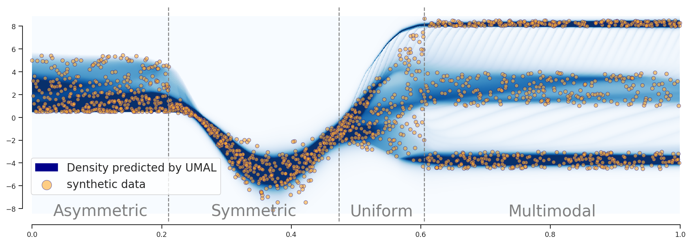

# Modelling heterogeneous distributions with an Uncountable Mixture of Asymmetric Laplacians
Implementation of UMAL: A deep learning model to estimate the distribution of the target variable in any regression task (using Tensorflow and Keras). 

The model is described in the paper: 

> ***Axel Brando, Jose A. Rodriguez-Serrano, Jordi Vitria, Alberto Rubio. "Modelling heterogeneous distributions with an Uncountable Mixture of Asymmetric Laplacians." Advances in Neural Information Processing Systems. 2019.***

This repository is an official collection of [Jupyter](https://jupyter.org/) notebooks to reproduce the public data set results reported in the article.  

<em>Synthetic regression problem with heterogeneous output distributions modelled with UMAL.</em>

## What is implemented

> - How to build UMAL model by using any Deep Learning architecture for regression [Algorithm 2 of the original paper].
> - How to generate the final conditional distribution using UMAL model [Algorithm 3 of the original paper].
> - How to calculate the conditional log-likelihood for a certain test set [Table 1 of the original paper].
> - UMAL Log-Likelihood (the loss function).

## Data

### Synthetic dataset

The notebook Synthetic regression.ipynb includes a script to generate the synthetic dataset used in the paper. 

### Room price dataset

The publicly available data was downloaded from:

**Murray Cox. Inside airbnb: adding data to the debate. Inside Airbnb. Available: http://insideairbnb.com, 2019.**

under a Creative Commons CC0 1.0 Universal (CC0 1.0) "Public Domain Dedication" license.

You have to collect the last time each apartment appeared within the months available from April 2018 to March 2019 in Barcelona and Vancouver cities (by using their 'listing-csv' files) to generate a unique pkl file that will be respectively loaded in each Notebook from the "data" folder. 

## Implemented visualisation functionalities

> - Visualization of the predicted distribution in the synthetic regression problem. 

## Summary of Notebooks
(Currently tested on Keras (2.2.4) and TensorFlow (1.14) but it was implemented to work in previous versions).

#### [UMAL results to the synthetic regression problem proposed in the paper](Room%20price%20forecasting%20problem%20-%20BCN.ipynb)

#### [UMAL results obtained in the proposed room price forecasting problem in Barcelona](Room%20price%20forecasting%20problem%20-%20YVC.ipynb)

#### [UMAL results obtained in the proposed room price forecasting problem in Vancouver](Synthetic%20regression%20problem.ipynb)

## Contact  

Feel free to contact us to discuss any issues, questions or comments.

Axel Brando ([Twitter](https://twitter.com/axelbrando_)-[Linkedin](https://www.linkedin.com/in/axelbrando/)), Jose A. Rodríguez-Serrano ([Twitter](https://twitter.com/qupixel)-[Linkedin](https://es.linkedin.com/in/jose-a-rodriguez-serrano-46505653)), Jordi Vitrà ([Twitter](https://twitter.com/bitenmascarado)-[Linkedin](https://es.linkedin.com/in/jordivitria)) and Alberto Rubio ([Twitter](https://twitter.com/aRubioMunoz)-[Linkedin](https://es.linkedin.com/in/arubiomunoz)).

## License

The content developed is distributed under the following license:

    Copyright 2019

    Licensed under the Apache License, Version 2.0 (the "License");
    you may not use this file except in compliance with the License.
    You may obtain a copy of the License at

       http://www.apache.org/licenses/LICENSE-2.0

    Unless required by applicable law or agreed to in writing, software
    distributed under the License is distributed on an "AS IS" BASIS,
    WITHOUT WARRANTIES OR CONDITIONS OF ANY KIND, either express or implied.
    See the License for the specific language governing permissions and
    limitations under the License.
